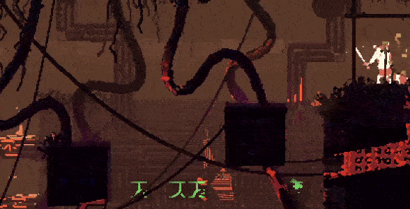
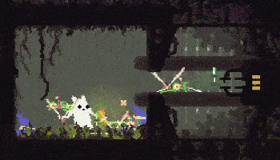

# HatWorld

by kadw (kadw#4425)

A mod for Rain World 1.5. Adds several hats to the game that you can find and wear. You can also give them to scavengers.

---

### Installation

### [Download the latest version here.](https://github.com/kadw108/HatWorld/releases)

You should use this mod with BepInEx. If you're not sure how to use BepInEx, there's a tutorial here: https://www.youtube.com/watch?v=brDN_8uN6-U

After you download HatWorld.zip from the Releases page and unzip it: Put HatWorld.dll and its dependencies (Fisobs.dll, ConfigMachine.dll, EnumExtender.dll, and CustomSpritesLoader.dll) inside your Mods folder (Steam\steamapps\common\Rain World\Mods). Enable all of them with BOIModManager. If you already have one of the dependency .dlls, you can skip or replace it.

Copy the ModConfigs folder into your Rain World folder (Steam\steamapps\common\Rain World). If you get a message asking "Confirm Folder Replace", click "Yes" and check "Do this for all current items". If you get a message asking "Replace or Skip Files", click "Replace the files in the destination".

#### Dependencies

This mod requires other mods to work. The other mods are included in the HatWorld.zip file. If you disable any one of them, this mod will stop working.

They are:

* Fisobs.dll
* ConfigMachine.dll
* EnumExtender.dll
* CustomSpritesLoader.dll

#### Uninstalling

IMPORTANT: If you disable the mod while having hats saved in ANY shelter, it will crash the game the next time you start it up. Make sure that all hats are removed from shelters.

Then disable HatWorld in BOIModManager. After deactivating HatWorld, you may delete HatWorld.dll from Rain World\Mods as well. Don't delete the other dependency .dlls, since other mods likely rely on them.

If the mod still seems to be active, check that HatWorld.dll has been deleted from your Rain World\BepInEx\plugins folder.

---

### Details

* Hats can be found in: Outskirts, Shoreline, Shaded Citadel, Underhang, Sky Islands, Garbage Wastes, Drainage System, and Moonlit Acres (modded region). There is one hat per region. If you don't have Moonlit Acres, you won't be able to find the eighth hat.
* Specific hat locations, if you don't feel like searching around, can be found here: https://docs.google.com/document/d/1KcXkLxrovO6I5cIBBBngGL8cgoMESO3Ev6rNjOvkWm4

* Like colored pearls, hats don't respawn.

* Moon has dialogue for all the hats.

* Some hats give a boost to your abilities. This can be turned off in the settings.

* Scavengers can wear hats if you give them one. (They won't pick them up or wear them on their own, probably.) This persists between cycles, so if you shelter with a scavenger wearing a hat, it will still wear the same hat the next cycle.

* All hats are unlocked by default in sandbox mode.

* Compatible with FancySlugcats and with SlugBase custom characters (except ElectricCat).

* Descriptions of each hat's location and what it does can be found here, if you don't mind spoilers: https://docs.google.com/document/d/1S1LbRIIXQU_kMjR6Af64dq6sfzKZ4B9TG5Y2Pteb5c0

---

### Known issues/incompatibilities

* If you disable the mod while having hats saved in ANY shelter, it will crash the game the next time you start it up.

* With ElectricCat mod (and FancySlugcats off?), hats won't show up on the player when worn.

* With FestiveWorld mod, hats will overlap the default santa hat (looks bizarre).

* Hats can't be spawned with Beastmaster.

---

### Adding custom hats

If you know how to mod, you can use HatWorld to add your own hats into the game. Requires knowledge of code (and willingness to engage with jank code). More details in the custom_hat_example folder.

---

Special thanks to the other modders out there and the tools they've made. Without them, this mod wouldn't exist. Particular thanks to Slime-Cubed for FestiveWorld and GrappleWorld, which I borrowed a lot of code from, and Dual-Iron's Fisobs API, which this is built on.

The mod hasn't been fully tested, so there may be bugs. For bugs/questions/comments/suggestions/anything really, message me on Discord (kadw#4425).

 
 
 
 
 
 
 
 
 
 
 
 
 
 
 
 
 
 
 

Still here? Here's your reward for reading the whole doc (or skipping to the end): Put a file named HatWorld_SpawnHat.txt in your Rain World\Mods folder to unlock a new option in the settings.
